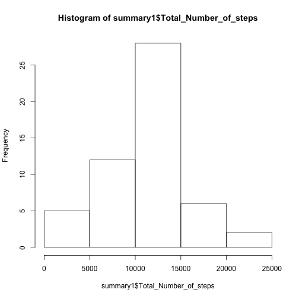
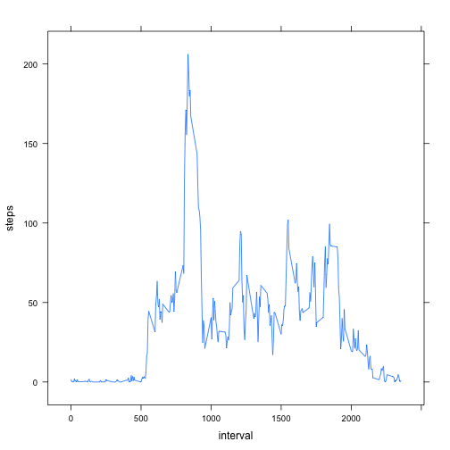
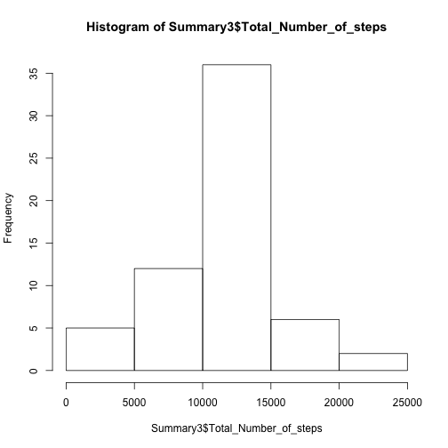
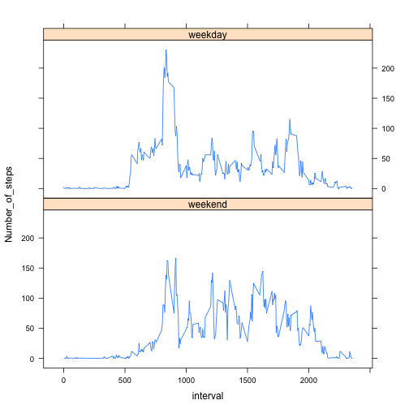

###Introduction

It is now possible to collect a large amount of data about personal movement using activity monitoring devices such as a Fitbit, Nike Fuelband, or Jawbone Up. These type of devices are part of the "quantified self" movement -- a group of enthusiasts who take measurements about themselves regularly to improve their health, to find patterns in their behavior, or because they are tech geeks. But these data remain under-utilized both because the raw data are hard to obtain and there is a lack of statistical methods and software for processing and interpreting the data.

This assignment makes use of data from a personal activity monitoring device. This device collects data at 5 minute intervals through out the day. The data consists of two months of data from an anonymous individual collected during the months of October and November, 2012 and include the number of steps taken in 5 minute intervals each day.

###Data

The variables included in this dataset are:

* steps: Number of steps taking in a 5-minute interval (missing values are coded as NA)

* date: The date on which the measurement was taken in YYYY-MM-DD format

* interval: Identifier for the 5-minute interval in which measurement was taken

The dataset is stored in a comma-separated-value (CSV) file and there are a total of 17,568 observations in this dataset.

###Loading and preprocessing the data

First let's load the data and the libraries we will need for this analysis:


```r
library(plyr)
```

```
## Warning: package 'plyr' was built under R version 3.1.3
```

```
## -------------------------------------------------------------------------
## You have loaded plyr after dplyr - this is likely to cause problems.
## If you need functions from both plyr and dplyr, please load plyr first, then dplyr:
## library(plyr); library(dplyr)
## -------------------------------------------------------------------------
## 
## Attaching package: 'plyr'
## 
## The following object is masked from 'package:lubridate':
## 
##     here
## 
## The following objects are masked from 'package:dplyr':
## 
##     arrange, count, desc, failwith, id, mutate, rename, summarise,
##     summarize
```

```r
library(lattice)
```

```
## Warning: package 'lattice' was built under R version 3.1.3
```

```r
activity<-read.csv("activity.csv")
```

###What is mean total number of steps taken per day?

The following code calculate the total number of steps taken per day


```r
summary1<-ddply(activity,c("date"),summarise,Total_Number_of_steps=sum(steps))
```

And this is a histogram of the total number of steps taken each day :


```r
hist(summary1$Total_Number_of_steps,freq=TRUE)
```

 

Here I am calculating (ignoring the Nas) the mean of the total number of steps taken per day...


```r
mean(summary1$Total_Number_of_steps,na.rm=TRUE)
```

```
## [1] 10766.19
```


...and the median of the total number of steps taken per day


```r
median(summary1$Total_Number_of_steps,na.rm=TRUE)
```

```
## [1] 10765
```

###What is the average daily activity pattern?

This is a time series plot of the 5-minute interval (x-axis) and the average number of steps taken, averaged across all days (y-axis) :


```r
Summary2<-ddply(activity,c("interval"),summarise,steps=mean(steps,na.rm=TRUE))
xyplot(steps~interval,Summary2,type = "l")
```

 

The folowing chunk of code shows us that the 5-minute interval, on average across all the days in the dataset, thet contains the maximum number of steps is at 8:35 AM with an average of 206.1698 steps.


```r
Summary2[which.max(Summary2$steps),]
```

```
##     interval    steps
## 104      835 206.1698
```

###Imputing missing values

Total number of missing values in the dataset (i.e. the total number of rows with NAs) :


```r
sum(is.na(activity)==TRUE)
```

```
## [1] 2304
```

We've already been calculating the average of steps taken for each specific interval of the day. To fill up the missing intervalls, I chose to take the averages of the coresponding intervals. This strategy could be compared to a "VLookUp" in Excel.

I will now create a new dataset that is equal to the original dataset but with the missing data filled in.

First, here the code producing the histogram of the total number of steps taken each day :

```r
missing<-activity[is.na(activity$steps)==TRUE,]
present<-activity[is.na(activity$steps)==FALSE,]
missing2<-missing[,c("interval","date")]
present2 <- merge(Summary2,missing2,by="interval")
present2<-present2[c("steps","date","interval")]
activity_complet<-rbind(present,present2)
Summary3<-ddply(activity_complet,c("date"),summarise,Total_Number_of_steps=sum(steps))
hist(Summary3$Total_Number_of_steps,freq=TRUE)
```

 

Here is the mean of the total number of steps  taken per day :

```r
mean(Summary3$Total_Number_of_steps)
```

```
## [1] 10766.19
```

And here is the median of the total number of steps  taken per day :

```r
median(Summary3$Total_Number_of_steps)
```

```
## [1] 10766.19
```

Do these values differ from the estimates from the first part of the assignment? 

* The mean is exactly the same and the median slighlty differs.

What is the impact of imputing missing data on the estimates of the total daily number of steps?

* Considering the way the missing data were imputed, we can assume that there are no difference between the first and second median. We can only note on the histogram an increase of the frequency of the 10000-15000 interval.

###Are there differences in activity patterns between weekdays and weekends?

Creates a new factor variable, "day", in the dataset with two levels – “weekday” and “weekend” indicating whether a given date is a weekday or weekend day:


```r
day<-weekdays(as.Date(activity_complet$date,format="%Y-%m-%d"))
daily_activity<-cbind(day,activity_complet)
levels(daily_activity$day)<-c("weekend","weekday","weekday","weekday","weekday","weekend","weekday")
```

Makes a panel plot containing a time series plot (i.e. type = "l") of the 5-minute interval (x-axis) and the average number of steps taken, averaged across all weekday days or weekend days (y-axis).


```r
Summary<-ddply(daily_activity,c("day","interval"),summarise,Number_of_steps=mean(steps))
xyplot(Number_of_steps~interval|day,Summary,type = "l",layout=c(1,2))
```

 
